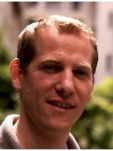

<table width="100%">
	<tr>
		<td style="vertical-align:top;" align="left">
			<h1>IT Project Manager</h1>
			Curriculum Vitae
		</td>
		<td style="vertical-align:bottom;" align="right" width="22%">
			<b>Clément Igonet</b>  
			<clement@igonet.fr>  
			French nationality, 35, Married, 1 child 
			2 allée des peupliers  
			78470 Saint Remy / FRANCE 
			Tél: 06 70 91 58 06  
		</td>
		<td align="right"></td>
	</tr>
</table>

----

>  10 years of experience

----

COMPETENCES
--------------------

Software development
:	* Languages: C, C++, JAVA, bash
	* Systems: Debian GNU/Linux
	* Software tools: Maven, Netbeans, GCC, OpenJDK, pandoc

Management
:	* Project scheduling, client need analysis, software specification writing, tests, requirement covering
	* Leader of SW team and technical trainer

System Administration
:	* Administration of virtual machines on VMware ESXi Server
	* Installation and maintenance of continuous integration tools (maven, archiva, jenkins, mercurial) and bug tracker (redmine)

IT security
:	
	* Risk analysis (EBIOS), ISO 27001 enforcement and internal audits
	* Security policy and business continuity plan writing

PROFESSIONNAL EXPERIENCE
--------------------

2010-2013
:   ***Software engineer** at [DEF](http://def-online.com)*
	(Massy, France).

	* Leader of C++ software developement on embedded system [uCLinux](http://www.uclinux.org/) for fire safety panel relayed by ethernet and GPRS.
	* Java Development of a 3D Fire Monitoring Systems (JAVA, Swing, OpenGL via JOGL), user right management, licences and software protection implementation.

	* Software project scheduling, software and system specifications writing, test plans
	* Implementation of continuous integration processes for softwares (maven, jenkins, mercurial, VirtualBox, VMware ESXi)
	* Technician training, software presentation to clients

2008-2010
:	***Software research & development engineer** at [CRYPTOLOG](http://www.cryptolog.com)* (Paris, France).

	* Développement de la couche TCP en langage Java.
	* Intégration de signatures électroniques pour échanges de données (standard EDI/EANCOM).
	* Obfuscation de code avec Proguard pour édition de logiciels clients.
	* Tests de robustesse sur applications web.
	* Analyse de risques EBIOS et ISO 27005, rédaction de politiques de sécurité et mises en application.

2008
:	***Création d'entreprise** de production et import de textiles* (Paris, France / Ho Chi Minh Ville, Vietnam)

	* Modélisation de produits textiles, études packaging.
	* Création de sites web de vente en ligne (cakephp, oscommerce).
	* Gestion administrative et comptabilité, démarche auprès des marques de distribution.

2005-2008
:	***Chef de projet Java JEE** à la [DRH de l'Armée de Terre](http://www.defense.gouv.fr/terre/presentation/directions-commandements-et-centres/ressources-humaines/direction-des-ressources-humaines-de-l-armee-de-terre) (Paris)*

	* Développement d'application de notation pour gestion R.H. avec interaction avec SAP, maintenance, correction de failles et optimisation de traitements, extraction d'informations de documents MS Word vers BDD Oracle.
	* Planification de projet et encadrement d'une équipe de développeurs (4 personnes).
	* Mise en place de méthodes et d'outils qualité pour le développement logiciel.

2003-2005
:	***Officier de maintenance de programme SIC** à la [DCMAT](http://www.defense.gouv.fr/terre/presentation/directions-commandements-et-centres/maintenance/direction-centrale-du-materiel/%28language%29/fre-FR#SearchText=direction%20centrale#xtcr=1) (Versailles Satory)*

	* Coordination des actions de mise en service et de maintenance avec les différents organismes militaires (DGA, états majors, régiments, etc...).
	* Gestion de budget et suivi comptable du parc informatique.

2002
:	***Stage Ingénieur R&D** à l'[ONERA](http://www.onera.fr/fr/nos-centres/midi-pyrenees-toulouse) (Toulouse)*

	* Développement d'outils (drivers, IHM) pour pilotage de caméras.
	* Outils utilisés: Labview, LCC-Win32, Visual C++.

2001-2002
:	*Projets d'étude (ISMA, Clermont Ferrand)*

	* Simulation hardware de fonction 3D (System C, C++).
	* Simulation d'une architecture matérielle de routeur réseau (CAO Mentor).
	* Modélisation de processeur RISC en VHDL.

2000-2001
:	*Développement logiciel et création d'entreprise SERIAL DREAMERS, 13510 Eguilles*

	* Développement d'un client IRC en C (LCC-Win32).
	* Développement de sites web (PHP, MySQL).
	* Administration serveurs Apache sous GNU/Linux.

ACADEMIC QUALIFICATIONS
--------------------

2013
:	Formation **API REST en Java** (2 jours, ORSYS, Paris)
2007
:	Formation **Anglais** (4h/semaine, 12 mois, Wall Street Institute, Paris)
2006
:	Formation **Revue de code Java** (1 semaine, Isoscope)
2005
:	Formation **JAVA JEE** (7 semaines, Atos Origin)
2003
:	Formation **Officier Armée de Terre** (4 mois, ESM Saint Cyr, Coëtquidan)
2002
:	Diplôme d'**Ingénieur en Informatique**, spécialisé en développement & électronique numérique (3 ans, ISIMA, Clermont Ferrand)
1996-1999
:	Classes préparatoires **Math Sup/Math Spé** (PSI, Lycée Vauvenargues, Aix en Provence)

DIVERS
--------------------

LANGUES
:	* **Anglais courant**
	* Espagnol: compréhension générale
ENCADREMENT
:	* 2008-2013: Intervenant formateur "culture informatique, algorithmique, HTML et Architecture des PC" (École Militaire, Paris)
	* 2005-2007: Encadrement JAPD
	* 2001-2002: Animateur "initiation à internet" (Marie de Clermont Ferrand)
	* 2000-2002: Instructeur fédéral de karaté (Yoseikan Budo, Clermont Ferrand)
	* 1999-2000: Secrétaire bureau de éléves (ISIMA, Clermont Ferrand)
LOISIRS
:	* Course à pieds (semi-marathons), VTT, natation, football

