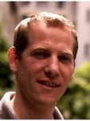

<table width="100%">
	<tr>
		<td style="vertical-align:top;" align="left">
			<h1>IT Project Manager</h1>
			<h3>Resume</h3> 
		</td>
		<td style="vertical-align:bottom;" align="right" width="35%">
			<b>Clement Igonet</b>  
			French nationality 
			<clement@igonet.fr>  
			36, Married, 1 child 
			2 allée des peupliers  
			78470 Saint Rémy  
			Tél: +33 670 915 806  
		</td>
		<td align="right"></td>
	</tr>
</table>

----

>  10 years of experience

----

COMPETENCES
--------------------

Software development
:	* Languages: C++, C, JAVA, bash
	* Operating system: Debian GNU/Linux
	* Software tools: Maven, Netbeans, GCC, IcedTea, pandoc

Project Management
:	* Project scheduling, client need analysis
	* Software specification writing, tests, requirement covering
	* Leader of SW team and technical training

PROFESSIONNAL EXPERIENCE
--------------------

2010-2013
:   ***Software engineer** at [DEF](http://def-online.com)*	(Massy, France):

	* Leader of C++ software developement on [uCLinux](http://www.uclinux.org/) embedded system
	* Java/Swing development of 3D Fire Alarm Monitoring Systems (OpenGL)
	* Project scheduling, specifications writing, test plans
	* Implementation of continuous integration processes for softwares

2008-2010
:	***Software R&D Engineer** at [CRYPTOLOG](http://www.cryptolog.com)* (Paris, France):

	* Development of TCP network protocol with (C, Java)
	* Digital signature integration for EDI/EANCOM protocol.

2005-2008
:	***Java JEE project leader** at [HRD of French Army](http://www.defense.gouv.fr/terre/presentation/directions-commandements-et-centres/ressources-humaines/direction-des-ressources-humaines-de-l-armee-de-terre) (Paris, France)*:

	* Software development for Human Resources management
	* Project scheduling and SW team leader (5 persons)

2003-2005
:	***Maintenance Officer for Information and Communication Systems programs** at [DCMAT](http://www.defense.gouv.fr/terre/presentation/directions-commandements-et-centres/maintenance/direction-centrale-du-materiel/%28language%29/fre-FR#SearchText=direction%20centrale#xtcr=1) (Versailles Satory, France)*

	* Qualification and distribution of technical operation of maintenance
	* Budget management and quantitative monitoring of IT park

2002
:	***R&D Engineer internship** at [ONERA](http://www.onera.fr/fr/nos-centres/midi-pyrenees-toulouse) (Toulouse, France)*

	* Tools development (drivers, GUI) for camera control

EDUCATION
--------------------

2007
:	**English** training (4h/week, 12 months, Wall Street Institute, Paris, France)
2003
:	Officer training in French Army. (4 months, ESM Saint Cyr, Coëtquidan, France)
2002
:	Information Technology Masters Degree (3 years, ISIMA, France)

OTHERS
--------------------

Languages
:	* Fluent english

Hobbies
:	* Running (half marathon), bike, swimming, soccer
