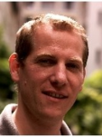

<table width="100%">
	<tr>
		<td style="vertical-align:top;" align="left" width="60%">
			<h1>DevOps</h1>
			Curriculum Vitae
		</td>
		<td style="vertical-align:bottom;" align="right" width="22%">
			<b>Clément Igonet</b>  
			<clement@igonet.fr>  
			38 ans  
			2 allée des peupliers  
			78470 Saint Rémy  
			Tél: 06 70 91 58 06  
		</td>
		<td align="right"></td>
	</tr>
</table>

----

>  12 ans d'expérience

----

Compétences
--------------------

Industrialisation logicielle
:   * Mise en place de chaînes d'intégration continue (maven, Jenkins, nexus)
    * Outils maitrisés: git, Maven, JIRA, Redmine, Pandoc, JUnit, Sonar, bash

Virtualisation d'environnements
:   * Virtualisation complète de machines (linux, windows, mac) et de services web
    * Outils maîtrisés: packer, vagrant, ansible, docker

Expériences professionnelles
--------------------

2014-2016
:   ***Ingénieur DevOps** chez [Galaxy Semiconductor](http://www.galaxysemi.com/)*
	(Dourdan, France):

	* Livraisons logicielles automatisées, suivi des dépendances et versions
	* Mise en place d'outils d'intégration continue avec Jenkins
	* Virtualisation des environnement de compilation et de tests
	* Automatisation des tests et scenarios, génération de rapports de tests

2010-2014
:   ***Ingénieur étude et développement** chez [DEF](http://def-online.com)*
	(Massy, France):

	* Responsable de projet C/C++ sur système embarqué ARM, [uCLinux](http://www.uclinux.org/)
	* Développement JAVA/Swing d'un superviseur incendie 3D en OpenGL
	* Planification des activités, rédaction des spécifications, plans de tests
	* Mise en place d'outils d'intégration continue: maven, jenkins, redmine, ESXi

2008-2010
:	***Ingénieur R&D Java** chez [CRYPTOLOG](http://www.cryptolog.com)* (Paris, France):

	* Développement protocole réseau TCP over Ethernet (C et Java)
	* Intégration de signatures électroniques pour échanges EDI/EANCOM

2005-2008
:	***Chef de projet Java JEE** à la [DRH de l'Armée de Terre](http://www.defense.gouv.fr/terre/presentation/directions-commandements-et-centres/ressources-humaines/direction-des-ressources-humaines-de-l-armee-de-terre) (Paris)*:

	* Développement d'application JAVA/JEE pour gestion R.H.
	* Planification de projet et encadrement d'une équipe de développeurs

2003-2005
:	***Officier de maintenance de programme SIC** à la [DCMAT](http://www.defense.gouv.fr/terre/presentation/directions-commandements-et-centres/maintenance/direction-centrale-du-materiel/%28language%29/fre-FR#SearchText=direction%20centrale#xtcr=1) (Versailles Satory)*

	* Définition et répartition des opérations techniques de maintenance
	* Gestion de budget et suivi comptable du parc informatique

2002
:	***Stage Ingénieur R&D** à l'[ONERA](http://www.onera.fr/fr/nos-centres/midi-pyrenees-toulouse) (Toulouse)*

	* Développement d'outils (drivers, IHM) pour pilotage de caméras
	* Outils utilisés: Labview, LCC-Win32, Visual C++

Diplômes / Formations
--------------------

2014
:   Formation **Anglais** (3h/semaine, 12 mois, cours particuliers)
2007
:	Formation **Anglais** (4h/semaine, 12 mois, Wall Street Institute, Paris)
2003
:	Formation **Officier Armée de Terre** (4 mois, ESM Saint Cyr, Coëtquidan)
2002
:	Diplôme d'**Ingénieur en Informatique** (3 ans, ISIMA, Clermont Ferrand)

Divers
--------------------

Langues
:	Anglais courant
Loisirs
:	Natation, VTT, course à pied

